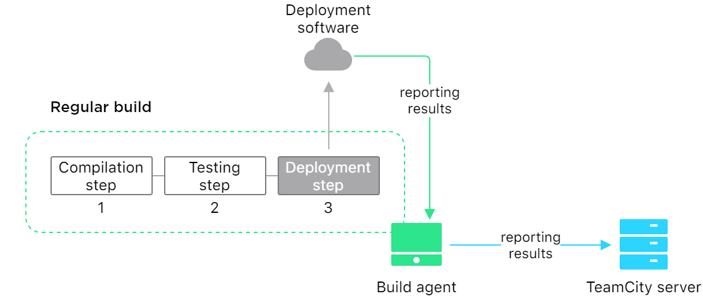
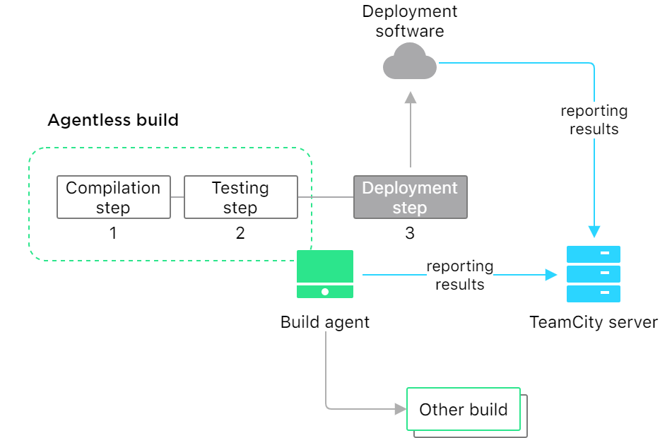

[//]: # (title: Agentless Builds)
[//]: # (auxiliary-id: Agentless Builds)

In terms of 2020.2 EAP, TeamCity introduces _agentless builds_ – builds that can run virtually, without an [agent](build-agent.md).

Under normal conditions, a build agent is required to run a build from start to finish. Now, your build can send an instruction to "release" the currently occupied agent. This agent becomes available to other builds, and the current build continues and then finishes outside TeamCity.  
This case is optimal for configurations that use third-party tools for finalizing a build: for example, to deploy a project. In the previous versions of TeamCity, an agent would wait until the external tool is done with its tasks which might take a long time. Since this version, the TeamCity server can handle the final stage of a build without the agent if there are no more build operations that depend on the agent’s software.

Let's compare a regular build that consists of three steps. All of them depend on an agent even though the deployment step is actually performed by the external software.



With the agentless approach, the agent does not need to handle the final step. The TeamCity server will catch the reports directly from the external tool.



## Detaching build agent

To release its current build agent, a build needs to send the `##teamcity[detachedFromAgent]` [service message](service-messages.md). We highly recommend detaching a build from the agent only during its last step. Make sure this step does not require the agent and can be performed outside of TeamCity.  
TeamCity will skip all the following steps after the build is detached, unless they have the "[Always, even if build stop command was issued](configuring-build-steps.md#Execution+policy)" option enabled. You can enable it for mandatory final steps – the agent will be released only after completing them.

After being released, the agent becomes available to other builds. The server will receive and log all remaining build status information received from the third-party tool.

Service messages are supported inside the REST API request data.

## Logging build data

Agentless builds can receive logs from external tools via [TeamCity REST API](rest-api.md).

To perform requests, you need to use [build-level authentication](artifact-dependencies.md#Build-level+authentication) credentials. Please use the following predefined build system properties for your requests:
* `%system.teamcity.auth.userId%`
* `%system.teamcity.auth.password%`

You also need to specify the [build ID](working-with-build-results.md#Internal+Build+ID) and server URL:
* `%system.teamcity.build.id%`
* `%system.teamcity.serverUrl%`

Use the following call to log messages:

```shell script
POST /app/rest/runningBuilds/id:<build_id>/log 
(curl -v --basic --user <username>:<password> --request POST http://<teamcity.url>/app/rest/runningBuilds/id:<build_id>/log --data <message> --header "Content-Type: text/plain")
```

Here, you can send the ["detach" service message](#Detaching+build+agent) as `<message>`.

Use the following call to finish the build:

```shell script
PUT /app/rest/runningBuilds/id:<build_id>/finishDate
(curl -v --basic --user <username>:<password> --request PUT http://<teamcity.url>/app/rest/runningBuilds/id:<build_id>/finishDate --data '' --header "Content-Type: text/plain")
```

In `--data ''`, you can send the build finish timestamp in the `yyyyMMdd'T'HHmmssZ` format. Leave the value empty to use the current time.

Without the finishing request, the build will be running on the TeamCity server until reaching its specified timeout, if any.

## Agentless builds' licensing

The number of agentless builds allowed on the server equals the number of licensed agents.
